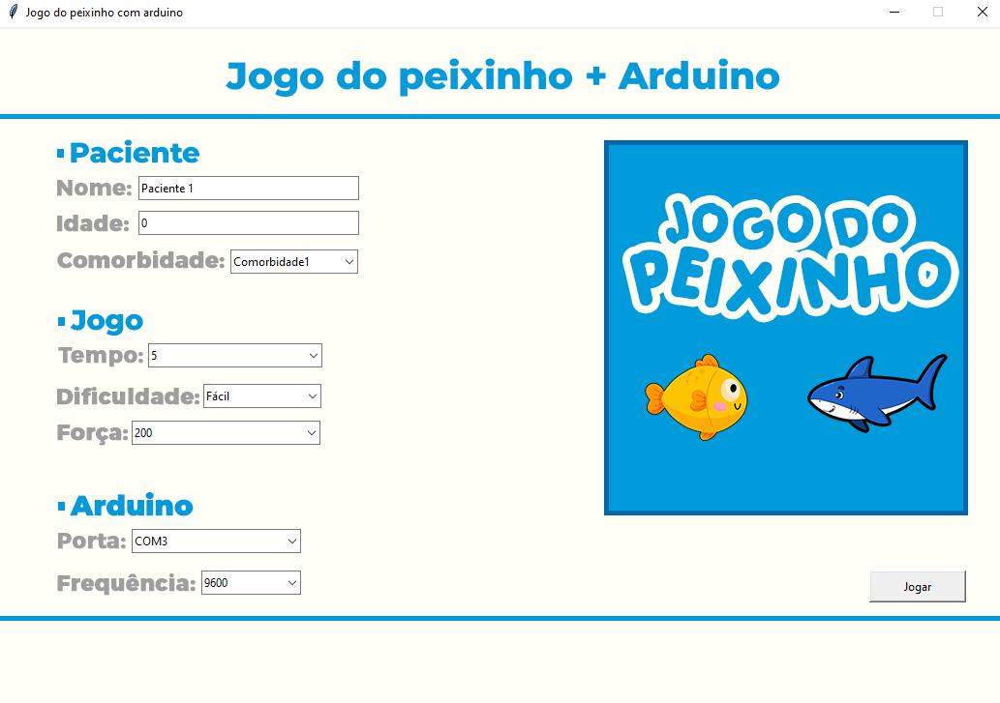

# Jogo do Peixinho + Arduino
## Introdução e Objetivo
Este projeto apresenta um software destinado a auxiliar pacientes com dificuldades motoras a interagir com computadores e outros dispositivos eletrônicos. Inspirado no jogo do dinossauro do Google Chrome, o programa capta sinais de contrações musculares por meio de um Arduino e um sensor de eletromiografia (EMG). Os dados coletados são enviados e processados pelo software, transformando as contrações musculares em ações e mecânicas dentro do jogo.

A mecânica do jogo foi recriada no ambiente Python, mantendo a essência do jogo original do dinossauro, com modificações apenas nos personagens e nos recursos visuais. O jogador, conectado a sensores musculares, controla o personagem para pular e desviar dos obstáculos através de contrações musculares voluntárias. O software é capaz de diferenciar entre contrações voluntárias, movimentos comuns e espasmos musculares menores.

Tela de Configuração
Ao iniciar o programa, uma tela de pré-configuração é apresentada, permitindo ao usuário definir informações sobre o paciente, o jogo e a conexão com o Arduino. A interface foi projetada para acomodar a diversidade de pacientes que podem usar o software, permitindo ajustes personalizados conforme as necessidades específicas de cada um.

## Funcionalidades Técnicas
Utilizando a biblioteca Tkinter do Python, foi desenvolvida uma interface intuitiva que auxilia o usuário na configuração do jogo e na descrição do paciente. A janela de configuração inclui os seguintes campos de entrada:

- Paciente: Nome, idade e comorbidades.
- Jogo: Tempo, dificuldade e nível de força.
- Arduino: Porta de conexão e frequência.

Valores padrão são fornecidos para todas as informações obrigatórias.
Alguns campos, como frequência e porta de conexão, apresentam listas de opções pré-definidas para facilitar a escolha pelo usuário.

Após realizar as configurações desejadas, o usuário pode clicar em "Jogar" para iniciar o jogo com as definições selecionadas. É importante que o Arduino e os sensores estejam configurados corretamente para garantir a precisão do sinal e um bom desempenho no jogo.

### Exemplo:

## Bibliotecas Utilizadas
O desenvolvimento do software utilizou diversas bibliotecas para implementar a interface gráfica, a lógica do jogo e a comunicação com o hardware. As principais bibliotecas empregadas foram:

- Pygame: Utilizada para recriar a mecânica do jogo e gerenciar gráficos, sons e eventos.
- Sys: Oferece acesso a funcionalidades específicas do sistema, como a saída do programa.
- Os: Usada para interações com o sistema operacional, como manipulação de arquivos e diretórios.
- Random: Utilizada para gerar valores aleatórios, essencial para a criação de obstáculos no jogo.
- Serial: Responsável pela comunicação serial com o Arduino, permitindo a leitura dos sinais de eletromiografia.
- Threading: Implementa o gerenciamento de threads para operações paralelas, garantindo uma resposta mais ágil do software.
- Matplotlib.pyplot: Utilizada para a criação de gráficos que representam o desempenho do paciente durante o jogo.

Essas bibliotecas foram escolhidas por sua eficiência e facilidade de integração, contribuindo para um desenvolvimento mais ágil e um desempenho robusto do software.

## Resultados e Análise
Ao final do tempo de jogo, uma lista com todas as informações do usuário e seu desempenho é apresentada. Esta lista, acompanhada de representações gráficas, destaca os valores mais altos de força que o paciente conseguiu atingir. A partir desses dados, é possível obter uma boa indicação sobre a capacidade motora do paciente. Este jogo representa um passo significativo no desenvolvimento de um modelo mais abrangente de interação homem-máquina.

# Promps utilizados para criação do artigo
## Texto original:

"• Introdução e objetivo do software 
Nesse projeto, apresento um software destinado a ajudar pacientes com dificuldades motoras a se comunicar com computadores e demais dispositivos eletrônicos. Inspirado no jogo do dinossauro do Google chrome, esse programa é capaz de captar sinais de contrações musculares, por meio do arduíno e um sensor de eletromiografia.
Ao recolher os dados, os mesmos são enviados e tratados dentro do programa, transformando os dados enviados pela contração muscular, em ações e mecânicas dentro do jogo.
O jogo do dinossauro foi reconstruído dentro do ambiente python. A mecânica do jogo é idêntica ao do jogo do dinossauro do google chrome, com alterações apenas nos personagens e recursos visuais.

Ao conectar sensores musculares nos músculos do paciente, toda vez que é realizada uma contratação voluntária, o personagem dentro do game realiza a ação de pular, desviando dos obstáculos. 
O software possuí recursos para diferenciar contração voluntária de simples movimento comuns, ou até mesmo pequenos estamos musculares.
Ao iniciar o programa é apresentada uma tela de pré configuração. Nela, é possível definir informações sobre o paciente, jogo e conexão com o Arduino. A tela foi proteja pensando na diversidade de pacientes que podem usar o software, podendo ajustar o mesmo para cada tipo de necessidade 

• Parte técnica do software 
Usando a biblioteca tkinter, no python, foi possível desenvolver uma interface para auxiliar o usuário na configuração do jogo e descrição do paciente. A janela conta com os seguintes campos de entrada: Paciente(nome, idade e comorbidade), Jogo(tempo, dificuldade e força) e Arduíno (porta e frequência).
Todas as informações obrigatórias já vem com valores pré definidos. Algum campos, como o de frequência e porta, possui uma lista para auxiliar o usuário a escolher opções pré definidas.
Ao realizar as alterações necessárias, o usuário clicar em "jogar" e o jogo é executado com as configurações sentadas. Vale lembrar que é de suma importância ter um arduíno e sensores bem configurados para ter uma grande performance no sinal, e, consequentemente, um bom desempenho no jogo.
Ao final do tempo, é apresentada uma lista com todas as informações do usuário, juntamente ao desempenho dele no jogo. Essa lista que também será representada de maneira gráfica, possui dos valores mais altos de força que o paciente conseguiu obter. A partir dessa informação, é possíveis ter uma bom direção sobre a capacidade motora do paciente. O jogo é um importante passo no desenvolvimento de um modelo mais completo de interação homem máquina" 

## Prommtp
Revise, corrija e faça as alterações semânticas nescessário no texto acima. Seguindo as seguintes regras

{REGRAS}
- O texto será usando para duas finalidades: Descrição de um projeto no github e exemplo de um artigo para uma trabalho acadêmico 
- Use uma linguagem técnica, porém não muito complexa. Boa o suficiente para um leigo entender e que ao mesmo tempo seja um artigo.
- Adicione tópicos se achar viável (Seguindo padrões de um artigo)
- Caso quera olhar, esse é o repositorio do projeto(https://github.com/Santiigas/Jogo_do_peixinho_arduino)